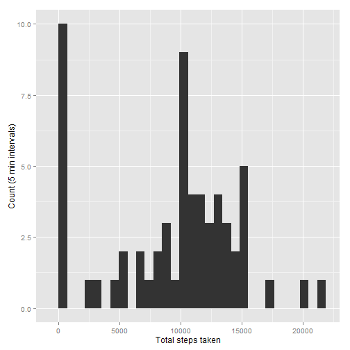
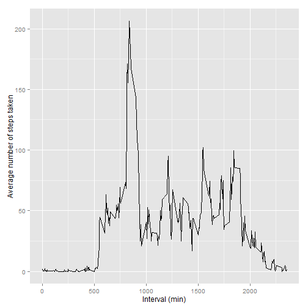
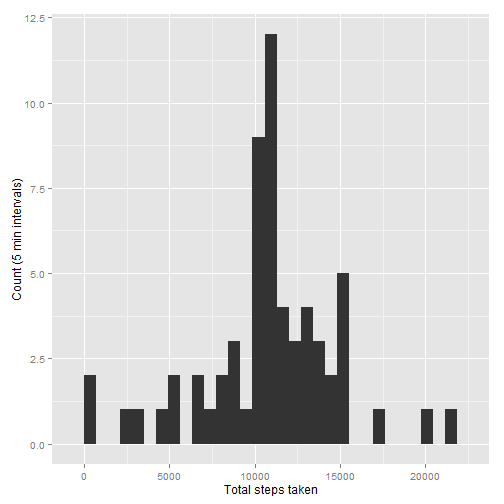
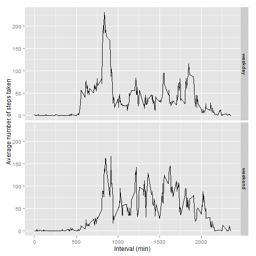

#Activity Monitoring Data - exploratory analysis

Preliminary loading of R packages to be used later in the analysis:

```r
library(dplyr)
library(lubridate)
library(ggplot2)
```

##Loading and preprocessing the data

This part of the code assumes that the file (.csv) containing the data exists in the present working directory.

```r
df_activity <- read.csv("activity.csv", header = TRUE)
```


##What is mean total number of steps taken per day?

Here, we group the data by date, then aggregate and sum up the number of steps taken on each date.


```r
df_activity_date <- group_by(df_activity, date)
df_act_dt_sum <- summarise(df_activity_date, total_steps = sum(steps, na.rm = TRUE))
```

1. Histogram of the total number of steps taken per day:

```r
g <- ggplot(df_act_dt_sum, aes(total_steps))
g <- g + geom_histogram()
g <- g + xlab("Total steps taken")
g <- g + ylab("Count (5 min intervals)")
g
```

```
## stat_bin: binwidth defaulted to range/30. Use 'binwidth = x' to adjust this.
```

 

2. Calculation and reporting of the mean and median total number of steps taken per day:

```r
mean(df_act_dt_sum$total_steps)
```

```
## [1] 9354.23
```


```r
median(df_act_dt_sum$total_steps)
```

```
## [1] 10395
```


##What is the average daily activity pattern?

Here, we group the data by interval (in minutes), then aggregate and sum up the number of steps taken in each interval.


```r
df_activity_time <- group_by(df_activity, interval)
df_act_tm_avg <- summarise(df_activity_time, average_steps = mean(steps, na.rm = TRUE))
```

1. Time series plot (i.e. type = "l") of the 5-minute interval (x-axis) and the average number of steps taken, averaged across all days (y-axis)

```r
h <- ggplot(df_act_tm_avg, aes(x = interval, y = average_steps))
h <- h + geom_line()
h <- h + ylab("Average number of steps taken")
h <- h + xlab("Interval (min)")
h
```

 

2. Identifying the 5 minute interval which has the maximum number of steps averaged across all days:

```r
max(df_act_tm_avg$average_steps)
```

```
## [1] 206.1698
```

```r
filter(df_act_tm_avg, average_steps >= max(df_act_tm_avg$average_steps))
```

```
## Source: local data frame [1 x 2]
## 
##   interval average_steps
## 1      835      206.1698
```


##Imputing missing values

1. Count the number of rows with missing values:

```r
sum(is.na(df_activity$steps))
```

```
## [1] 2304
```

2. We replace any missing values (steps) with the average of steps in the respective time intervals across all days.

```r
df_activity_replna <- left_join(df_activity, df_act_tm_avg, by = "interval")
df_activity_replna$steps[is.na(df_activity_replna$steps)] <- df_activity_replna$average_steps[is.na(df_activity_replna$steps)]
```

3. Creating a new dataset identical to the original - except the replaced values:

```r
df_activity_replna <- df_activity_replna[c("steps", "date", "interval")]
```

4. Histogram of the new dataset, along with mean and median of the number of steps - after replacing NA values:

```r
df_activity_replna_date <- group_by(df_activity_replna, date)

df_act_replna_dt_sum <- summarise(df_activity_replna_date, total_steps = sum(steps, na.rm = TRUE))

j <- ggplot(df_act_replna_dt_sum, aes(total_steps))
j <- j + geom_histogram()
j <- j + xlab("Total steps taken")
j <- j + ylab("Count (5 min intervals)")
j
```

```
## stat_bin: binwidth defaulted to range/30. Use 'binwidth = x' to adjust this.
```

 


```r
mean(df_act_replna_dt_sum$total_steps)
```

```
## [1] 10766.19
```


```r
median(df_act_replna_dt_sum$total_steps)
```

```
## [1] 10766.19
```


##Are there differences in activity patterns between weekdays and weekends?

1. Creation of a new factor variable in the dataset with two levels - "weekday" and "weekend" indicating whether a given date is a weekday or weekend day:


```r
df_activity_wkd <- mutate(df_activity_replna, day = weekdays(ymd(df_activity_replna$date)))
```

We use a temporary character vector (activity_day) containing only the 'day' field (created using weekdays() above), and use it in a loop to generate the factor vector (wkd_fctr) with two levels: 'weekday' and 'weekend'.


```r
activity_day <- df_activity_wkd$day

wkd_fctr <- character(length(activity_day))

for(i in 1:length(activity_day))
{
  if ((activity_day[i] == "Saturday") | (activity_day[i] == "Sunday"))
		wkd_fctr[i] <- "weekend"
	else
		wkd_fctr[i] <- "weekday"
}

wkd_fctr <- factor(wkd_fctr)
```

We then bind the factor vector to the dataset as a new column

```r
df_activity_wkd_fctr <- cbind(df_activity_wkd, wkd_fctr)
```


2. Panel plot containing a time series plot (i.e. type = "l") of the 5-minute interval (x-axis) and the average number of steps taken, averaged across all weekday days or weekend days (y-axis):

```r
df_act_wkd_fctr <- group_by(df_activity_wkd_fctr, interval, wkd_fctr)

df_act_wkd_fctr <- summarise(df_act_wkd_fctr, average_steps = mean(steps, na.rm = TRUE))


i <- ggplot(df_act_wkd_fctr, aes(x = interval, y = average_steps))
i <- i + geom_line()
i <- i + facet_grid(wkd_fctr~.)
i <- i + ylab("Average number of steps taken")
i <- i + xlab("Interval (min)")
i
```

 

This is the end of the document for exploratory analysis of the Activity dataset.
